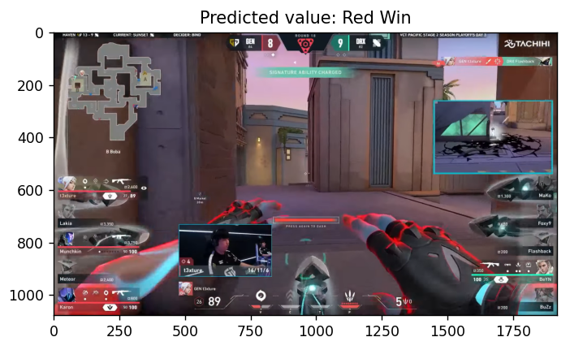
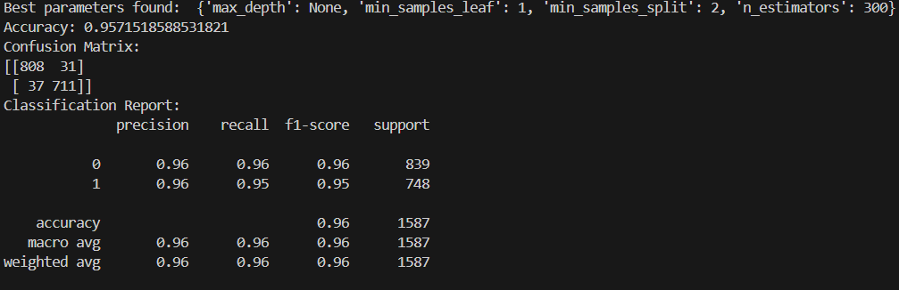

<body>

<h1>Valorant Match Analysis Tool</h1>

<nav>
    <ul>
        <li><a href="#overview">📝 Overview</a></li>
        <li><a href="#features">🔍 Features</a></li>
        <li><a href="#installation">🛠 Installation</a></li>
        <li><a href="#usage">🚀 Usage</a></li>
        <li><a href="#issues">🐛 Known Issues</a></li>
        <li><a href="#future">🔮 Future Enhancements</a></li>
        <li><a href="#contributing">🤝 Contributing</a></li>
        <li><a href="#license">⚖️ License</a></li>
    </ul>
</nav>

<section id="overview">
    <h2>📝 Overview</h2>
    
    
    
This tool captures screenshots of Valorant matches, analyzes them in real-time, and predicts match outcomes based on extracted features. It includes live visualizations of win rates and detailed feature tables for analysis.

    
However, as the live processing is only consistent 90% of the time, this tool also offers an option to predict based on a screenshot instead of capturing screenshots and predicting live.

</section>

<section id="training">
    <h2>💪 Training</h2>
    
This model is only trained on the following features extracted from the image

    <ul>
        <li>Number of players alive</li>
        <li>Health of each alive players</li>
        <li>Number of ability points</li>
        <li>Number of ults</li>
        <li>Time since spike is planted (0 if spike is not planted)</li>
    </ul>
    
Through the training process an accuracy of 95% can be achieved

</section>

<section id="features">
    <h2>🔍 Features</h2>
    <ul>
        <li><strong>Real-time Analysis:</strong> Screenshots of the selected Valorant game window are captured and processed at regular intervals.</li>
        <li><strong>Feature Extraction:</strong> Extracts various game features such as number of players alive, ability counts, health stats, and presence of game elements like spikes.</li>
        <li><strong>Machine Learning Prediction:</strong> Uses a trained machine learning model (Random Forest) to predict match outcomes based on extracted features.</li>
        <li><strong>Live Visualization:</strong> Displays live updates of win rates over time and detailed feature tables using Matplotlib.</li>
    </ul>
</section>

<section id="installation">
    <h2>🛠 Installation</h2>
    <ol>
        <li><strong>Clone the Repository:</strong> 
        <li>
            <strong>Install the dependencies</strong>
            <code>pip install -r requirements.txt</code>
        </li>
    </ol>
</section>

<section id="usage">
    <h2>🚀 Usage</h2>
    <ul>
        <li>
            <h3>Using Live Version</h3>
            <ul>
                <li>
                    <strong>Run the script</strong>
                    <code>python3 use_live_forest.py</code>
                </li>
                <li><strong>Select Valorant Window:</strong> 
                    <ul>
                        <li>A dialog will prompt you to select the Valorant game window from a list of currently open windows.</li>
                    </ul>
                </li>
                <li><strong>Monitor Live Updates:</strong> 
                    <ul>
                        <li>The application will start capturing and analyzing screenshots in real-time.</li>
                        <li>Win rates will be plotted dynamically, and feature tables will be updated continuously.</li>
                    </ul>
                </li>
                <li><strong>Interpret Results:</strong> 
                    <ul>
                        <li>View the live plot to monitor win rate trends.</li>
                        <li>Check the feature tables to understand the extracted data from each screenshot.</li>
                    </ul>
                </li>
            </ul>
        </li>
        <li>
            <h3>Using Single Image Version</h3>
            <ul>
                <li>
                    <strong>Change the image path at the bottom of the script (use_random_forest.py)</strong>
                </li>
                <li>
                    <strong>Run the script</strong>
                    <code>python3 use_random_forest.py</code>
                </li>
        </li>
    </ul>
</section>

<section id="issues">
    <h2>🐛 Known Issues</h2>
    <ul>
        <li>Occasional delays or inaccuracies may occur in feature extraction depending on game window visibility and performance.</li>
        <li>Slight inconsistencies in extraction of features when taking screenshots and predicting lvie</li>
    </ul>
</section>

<section id="future">
    <h2>🔮 Future Enhancements</h2>
    <ul>
        <li>Gather more data to train the model (currently trained with 7000 images)</li>
        <li>Add in additional features (e.g. agents played, guns used, economy)</li>
        <li>Improve feature extraction to increase reliability</li>
        <li>Enhance GUI for better user interaction and feedback.</li>
    </ul>
</section>

<section id="contributing">
    <h2>🤝 Contributing</h2>
    
Contributions are welcome! If interested, please fork the repository and submit a pull request with your improvements. I can provide the dataset for training.

</section>

<section id="license">
    <h2>⚖️ License</h2>
    
This project is licensed under the GNU License. See <code>LICENSE</code> for more details.

</section>

</body>
</html>
