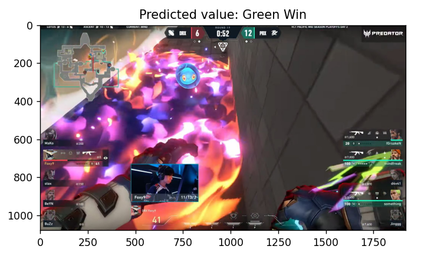

<body>

<h1>Valorant Match Analysis Tool</h1>

<nav>
    <ul>
        <li><a href="#overview">📝 Overview</a></li>
        <li><a href="#features">🔍 Features</a></li>
        <li><a href="#installation">🛠 Installation</a></li>
        <li><a href="#usage">🚀 Usage</a></li>
        <li><a href="#issues">🐛 Known Issues</a></li>
        <li><a href="#future">🔮 Future Enhancements</a></li>
        <li><a href="#contributing">🤝 Contributing</a></li>
        <li><a href="#license">⚖️ License</a></li>
    </ul>
</nav>

<section id="overview">
    <h2>📝 Overview</h2>
    
This tool captures screenshots of Valorant matches, analyzes them in real-time, and predicts match outcomes based on extracted features. It includes live visualizations of win rates and detailed feature tables for analysis.

</section>

<section id="features">
    <h2>🔍 Features</h2>
    <ul>
        <li><strong>Real-time Analysis:</strong> Screenshots of the selected Valorant game window are captured and processed at regular intervals.</li>
        <li><strong>Feature Extraction:</strong> Extracts various game features such as number of players alive, ability counts, health stats, and presence of game elements like spikes.</li>
        <li><strong>Machine Learning Prediction:</strong> Uses a trained machine learning model (Random Forest) to predict match outcomes based on extracted features.</li>
        <li><strong>Live Visualization:</strong> Displays live updates of win rates over time and detailed feature tables using Matplotlib.</li>
        <li><strong>User Interface:</strong> Simple GUI for selecting the Valorant game window to analyze.</li>
    </ul>
</section>

<section id="installation">
    <h2>🛠 Installation</h2>
    <ol>
        <li><strong>Clone the Repository:</strong> 
        <li><strong>Install Dependencies:</strong> 
        <li><strong>Download Model (if required):</strong> 
            <ul>
                <li>If the trained model (<code>best_rf_model.pkl</code>) is not included, ensure you download or generate it according to your model training process.</li>
            </ul>
        <li><strong>Run The Script:
            <ul>
              <li><code>python3 run_live_forest.py</code></li>
            </ul>
        </li>
        </li>
    </ol>
</section>

<section id="usage">
    <h2>🚀 Usage</h2>
    <ol>
        <li><strong>Select Valorant Window:</strong> 
            <ul>
                <li>A dialog will prompt you to select the Valorant game window from a list of currently open windows.</li>
            </ul>
        </li>
        <li><strong>Monitor Live Updates:</strong> 
            <ul>
                <li>The application will start capturing and analyzing screenshots in real-time.</li>
                <li>Win rates will be plotted dynamically, and feature tables will be updated continuously.</li>
            </ul>
        </li>
        <li><strong>Interpret Results:</strong> 
            <ul>
                <li>View the live plot to monitor win rate trends.</li>
                <li>Check the feature tables to understand the extracted data from each screenshot.</li>
            </ul>
        </li>
    </ol>
</section>

<section id="issues">
    <h2>🐛 Known Issues</h2>
    <ul>
        <li>Occasional delays or inaccuracies may occur in feature extraction depending on game window visibility and performance.</li>
    </ul>
</section>

<section id="future">
    <h2>🔮 Future Enhancements</h2>
    <ul>
        <li>Gather more data to train the model (currently trained with 7000 images)</li>
        <li>Integration with cloud services for remote monitoring and analysis.</li>
        <li>Support for multiple game windows or simultaneous analysis.</li>
        <li>Enhance GUI for better user interaction and feedback.</li>
    </ul>
</section>

<section id="contributing">
    <h2>🤝 Contributing</h2>
    
Contributions are welcome! If interested, please fork the repository and submit a pull request with your improvements. I can provide the dataset for training.

</section>

<section id="license">
    <h2>⚖️ License</h2>
    
This project is licensed under the GNU License. See <code>LICENSE</code> for more details.

</section>

</body>
</html>
